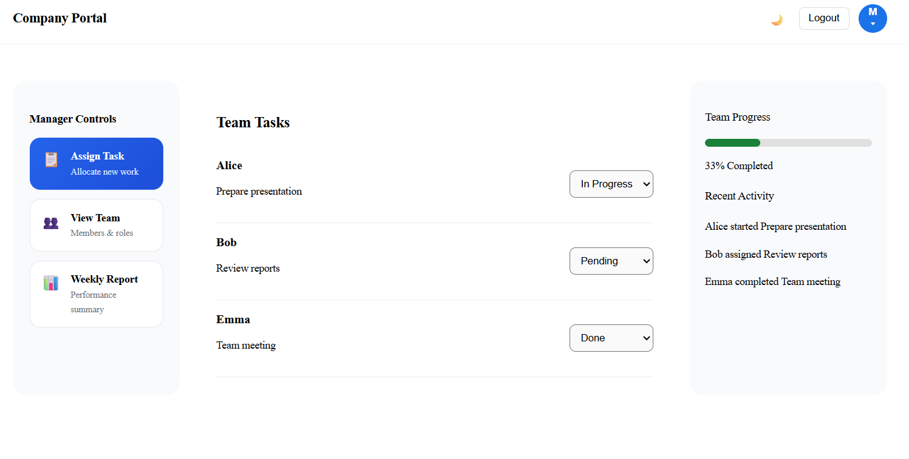
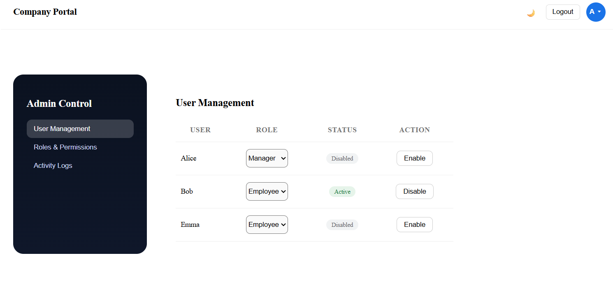

# Company Portal – Role-Based Access Control (RBAC)

A role-based internal company portal built using React, designed to simulate real-world internal tools used by organizations.
The application provides different dashboards and permissions for Employees, Managers, and Admins using Role-Based Access Control (RBAC).

##  Project Overview

This project demonstrates how a single application can serve multiple user roles with different UI views, actions, and permissions, similar to real internal enterprise systems.

The focus is on:
* Practical business workflows
* Clean UI and component structure
* Role-based access control
* Interactive dashboards

##  Roles & Features

### Employee

* View assigned tasks
* Update task status
* Daily activity feed
* Task insights (total, completed, overdue)
* Interactive UI with animations and toast feedback
* Dark mode support

###  Manager

* View team tasks
* Update task status
* Track team progress
* Manager action panel
* Recent activity log
* Visual progress indicators

###  Admin

* User management (enable/disable users)
* Assign and manage roles
* Roles & permissions overview
* System activity logs
* Administrative controls and metrics

##  Key Concepts Used

* Role-Based Access Control (RBAC)
* Conditional rendering based on role
* Component-based architecture
* State management using React Hooks
* Reusable UI components
* Interactive UI feedback (animations, modals, toasts)
* Dark mode theming


##  Tech Stack

* **React**
* **JavaScript (ES6)**
* **HTML5**
* **CSS3**
* **Git & GitHub**


##  How to Run Locally

```bash
npm install
npm start
```
##  Screenshots

### 🧑‍💻Employee Dashboard
Personal task dashboard for employees with focus-based task view, daily activity feed, task insights, and interactive status updates.


---

### 👨‍💼 Manager Dashboard
Team management dashboard allowing managers to track team tasks, update task status, monitor progress, and view recent team activity.



---

### 🛡️ Admin Dashboard
Administrative control panel for managing users, assigning roles, viewing permissions, and monitoring system activity logs.



(Add screenshots of Employee, Manager, and Admin dashboards here for better visibility.)

